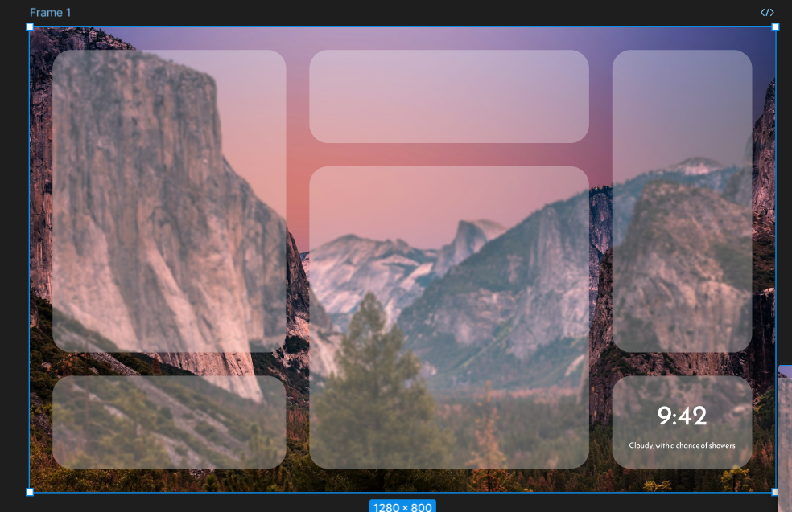

# displayThing
A bedside display showing your calendar, weather, and can play music and read the news

Made using Raspberry Pi, Qt, and some random stuff I found lying around.

So far it looks like this:

